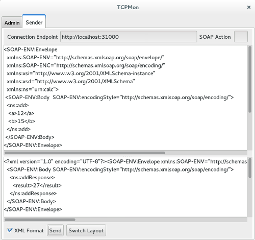

<HTML>
<BODY>
L'ensemble des serveurs peuvent être interrogés à travers l'application Java 'TCPMon' en y insérant une requête (contenue dans le répertoire 'test') sur l'écran supérieur. 
Paramétrer l'URL de connexion. 
On obtient ainsi le résultat sur l'écran du bas : 

</BODY>
</HTML>

